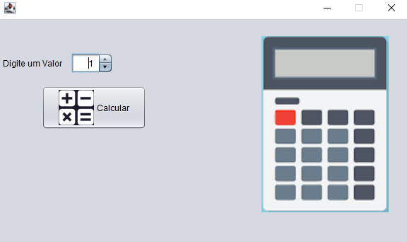
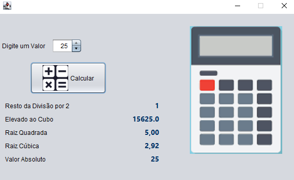

## Código - Super Calculadora 🔢

  

### Java - Curso em Vídeo ☕▶

Código desenvolvido na aula 7 do Curso em Vídeo - Java, foi elaborado uma calculadora funcional como resultado, neste projeto utilizamos Java com <strong>Swing</strong>. O Swing fornece vários componentes padrão de GUI que podem ser combinados de forma a criar sua interface (Botões, Listas, Menus, Áreas de texto, entre outros).

- [x] O programa vai exibir a interface gráfica da calculadora e com isso o usuário poderá selecionar o valor que quer que seja calculada as operações

### Tela inicial da interface 🔲

  

### tela após execução 👨🏽‍💻

  

- [x] Após selecionar o valor desejado e apertar o botão calcular, o programa vai exibir os resultados dos cálculos com o valor escolhido

## Tecnologias 🛠

- Java ☕

## Instrutor 👨🏽‍🏫
- <a target="_blank" href="https://www.linkedin.com/in/guanabara/">Gustavo Guanabara</a>

## Aluno 👨🏽‍🎓

- <a target="_blank" href="https://www.linkedin.com/in/ramon-barreto-076191180/">Ramon Barreto</a>

## Contato 📲

- Email: ramon_barreto_medrado@hotmail.com